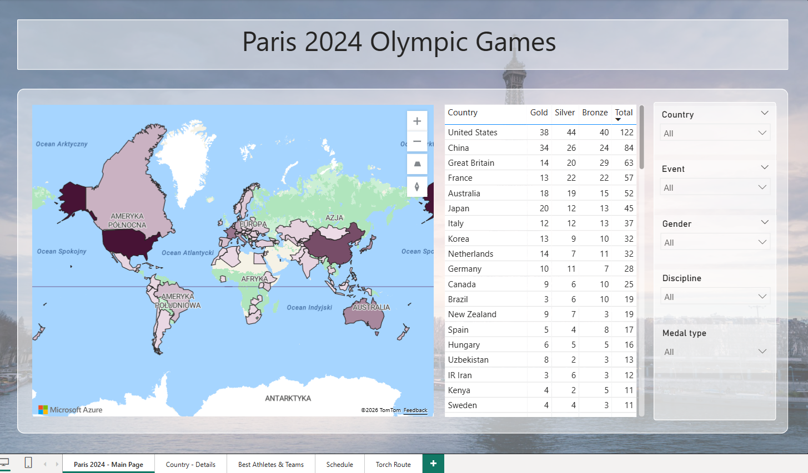

# Paris 2024 Olympic Games - Power BI Dashboard

An interactive Power BI report exploring Olympic data through data modeling, DAX, and interactive analytics - covering medal standings, athlete performance, schedules, and the torch relay route.



---

## About

This project transforms publicly available Olympic data into an interactive Power BI report, enabling exploration of results, athletes, schedules, and the Olympic torch relay across France and overseas territories.

Data sourced from a public Kaggle dataset. Significant transformation was required before the data could be used in the model.

---

## How It Works

The report is designed as an interactive analytical experience:

- Explore medal standings on an interactive world map
- Drill through from country level to detailed statistics
- Analyze athlete and team performance with dynamic rankings
- Filter competition schedules by date, venue, and sport
- Visualize the torch relay route from Olympia to Paris

---

## Technical Highlights

- Data model: 11 tables (star/snowflake schema)
- Custom DAX measures handling medal deduplication in relay events
- Calculated columns for athlete ranking and geographic mapping
- Interactive map visuals and time-based animations

---

## Example DAX - Medal Deduplication

```dax
Gold Medals_uniq =
SUMX(
    SUMMARIZE(
        medallists,
        medallists[event],
        "UniqueGold", MAX(medallists[Gold medal])
    ),
    [UniqueGold]
)
```

---

## Example DAX - Athlete Ranking

```dax
PodiumRanking =
SWITCH(
    TRUE(),
    medallists[medal_type] = "Gold Medal", 3,
    medallists[medal_type] = "Silver Medal", 2,
    medallists[medal_type] = "Bronze Medal", 1,
    0
)
```

Geographic coordinates for the torch relay route were manually added for 70+ cities, including overseas territories.

---

## Tech Stack

Power BI (DAX, Power Query, data modeling, drill-through, map visuals, animations), Microsoft Azure Maps, Kaggle dataset

---

## How to Open

Download the `.pbix` file and open it in [Power BI Desktop](https://powerbi.microsoft.com/desktop/) (free).

---

## Author

Piotr Szczykutowicz

[LinkedIn](https://www.linkedin.com/in/piotr-szczykutowicz-51b493214/)
